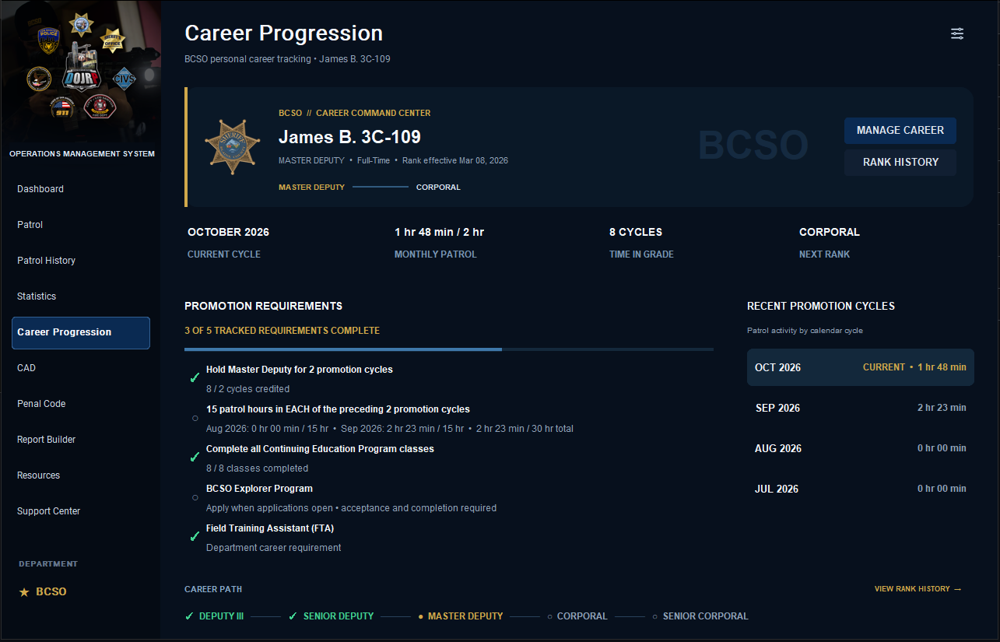

# DOJ OMS

### DOJRP Operations Management System

**A centralized Windows operations workspace built for DOJRP members.**

DOJ OMS brings the tools commonly used throughout DOJRP operations into one standalone desktop application.

Rather than keeping patrol tracking, Career Progression, department requirements, department resources, CAD access, Penal Code references, report preparation, statistics, and member information scattered across multiple locations, DOJ OMS provides a single workspace designed around the active profile and their department.

> **Current Release:** v1.7.0  
> **Platform:** Windows 10 / Windows 11  
> **Release Channel:** Stable  
> **Supported Departments:** BCSO, SAHP, LSPD & Civilian Operations

---

# Download DOJ OMS

The latest stable version of DOJ OMS is available through the **Releases** section of this repository.

### Installation

1. Open the latest DOJ OMS release.
2. Download the latest `DOJ_OMS_Setup` installer.
3. Run the installer.
4. Complete the Windows installation prompts.
5. Launch **DOJ OMS**.
6. Complete the initial identity setup.
7. Create or select your Officer Profile.

Existing users can install newer versions directly over their current installation. Supported locally stored profile, patrol, statistics, Career Progression, and application data are preserved during normal upgrades.

DOJ OMS also includes an integrated update system for detecting future releases.

---

# What is DOJ OMS?

DOJ OMS is designed to function as a centralized operational companion for DOJRP members across supported departments.

The application adapts around the user's **Profile and department**, allowing one installation to support members with different assignments, organizations, ranks, departments, patrol histories, resources, and career records.

Current functionality includes:

- Multi-department Officer Profiles
- Patrol session tracking
- Department, subdivision, business, and criminal-organization activity tracking
- Patrol history
- Patrol statistics
- BCSO, SAHP, LSPD & Civilian Career Progression
- Rank History
- Promotion and demotion tracking
- Training and certification tracking
- Department-specific qualifying activity tracking
- Department patrol-log integration
- Automatic patrol-log prefilling
- Automatic patrol-log timezone handling
- Department, subdivision, business, and criminal-organization resource libraries
- Quick Resources
- Direct DOJRP CAD access
- Local Penal Code references
- CAD Report Generator
- Standardized CAD Narrative documentation
- DOJRP member verification
- Discord Rich Presence
- Integrated application updates
- Support Center & Help Center
- Development Board

The goal is simple: **reduce the number of separate resources a DOJRP member needs to manage while providing a cleaner workspace for day-to-day operations.**

---

# Multi-Department Architecture

DOJ OMS uses a centralized multi-department architecture.

Rather than building major application systems around individual departments, DOJ OMS can now adapt supported functionality according to the department associated with the active Officer Profile.

Department-aware functionality includes:

- Department branding
- Rank structures
- Patrol assignments
- Career Progression
- Department Resources
- Quick Resources
- Patrol Logs
- Patrol History
- Statistics
- Department-specific report generation where applicable

This architecture allows DOJ OMS to continue expanding without requiring separate applications or disconnected systems for each department.

Current department support includes:

- Blaine County Sheriff's Office
- San Andreas Highway Patrol
- Los Santos Police Department
- Civilian Operations

The architecture supports both law-enforcement and Civilian workflows while establishing the foundation for additional department types in future releases.

---

# Supported Departments

## Blaine County Sheriff's Office

DOJ OMS provides full operational and Career Progression support for the **Blaine County Sheriff's Office (BCSO)**.

Supported BCSO assignments include:

- General Patrol
- Warrant Services Unit — WSU
- Wildlife Rangers — WLR
- Criminal Investigations Division — CID
- Traffic Enforcement Division — TED
- Canine / K9

BCSO Officer Profiles automatically receive the appropriate department resources, patrol options, Quick Resources, Report Builder presentation, patrol-log formatting, and Career Progression system.

---

## San Andreas Highway Patrol

DOJ OMS provides full operational and Career Progression support for the **San Andreas Highway Patrol (SAHP)**.

Supported SAHP assignments include:

- General Patrol
- BACO
- Investigations
- Canine / K9
- ADAT — DUI
- ADAT — MBU
- CVE
- MRU

SAHP integration includes department-specific ranks, auxiliary ranks, patrol functionality, resources, Quick Resources, Report Builder presentation, patrol-log formatting, and Career Progression.

---

## Los Santos Police Department

DOJ OMS v1.6.0 introduces full operational support for the **Los Santos Police Department (LSPD)**.

Supported LSPD assignments include:

- General Patrol
- Port Authority — PA
- Special Intelligence Division — SID
- Traffic Enforcement Unit — TEU

LSPD integration includes:

- Full-Time and Reserve rank structures
- Department and subdivision branding
- Patrol tracking
- Patrol History
- Statistics
- Career Progression
- Rank History
- Qualifying non-patrol activity tracking
- Department Resources
- Subdivision Resources
- Patrol Log integration
- Patrol Log prefilling
- Report Builder integration

DOJ OMS automatically adapts supported LSPD functionality according to the active Officer Profile and patrol assignment.

---

## Civilian Operations

DOJ OMS v1.7.0 introduces full operational and Career Progression support for **Civilian Operations**.

Civilian activity can be tracked through:

- General Civilian
- Business Organizations
- Criminal Organizations / Gangs

Civilian integration includes:

- Full-Time and Reserve rank structures
- Civilian-specific department branding
- General Civilian patrol tracking
- Timed Business Organization activity
- Timed Criminal Organization activity
- Business-specific branding where available
- Shared Criminal Organizations branding
- Patrol History
- Statistics
- Career Progression
- Rank History
- Department Requirements Reference
- Civilian Resources
- Business and Gang resources
- Civilian Patrol Log integration
- Patrol Log prefilling and review
- Civilian-specific Discord Rich Presence

Civilian profiles retain access to applicable shared tools such as CAD and the Penal Code while law-enforcement-only Report Builder functionality is excluded.

---

# Operations Dashboard

The Dashboard serves as the primary operational landing point after selecting an Officer Profile.

From the Dashboard, officers can quickly review their current profile and patrol status while accessing commonly used operational tools and department-specific resources.

Quick Resources automatically adapt to the active Officer Profile's department.

DOJRP CAD can also be opened directly through Dashboard Quick Actions.

---

# Profiles

DOJ OMS supports **multiple profiles** within the same installation.

Each profile can maintain its own:

- Department
- Name and unit number
- Badge Number / Web ID
- Rank
- Time zone
- Patrol history
- Patrol statistics
- Career Progression record
- Rank History
- Training and certification information

Switching profiles allows DOJ OMS to automatically adapt supported areas of the application to that member.

Department-specific resources, patrol assignments, Report Builder information, Career Progression, and other supported functionality change according to the active profile.

Career information remains isolated to the individual profile. Multiple profiles can therefore maintain completely independent career and patrol records within the same installation.

---

# Career Progression

Career Progression provides a personal workspace for tracking objective department progression requirements alongside the officer's existing patrol activity.

Career Progression currently supports:

- Blaine County Sheriff's Office
- San Andreas Highway Patrol
- Los Santos Police Department
- Civilian Operations

Depending on the department and current rank, DOJ OMS can track information including:

- Current rank
- Next rank
- Rank effective date
- Time in grade
- Promotion cycles
- Patrol activity
- Total qualifying activity
- Promotion-specific patrol requirements
- Department training
- Certifications
- Career qualifications
- Learning Domains
- Rank History

Career Progression uses applicable patrol activity already recorded within DOJ OMS when evaluating supported patrol-hour requirements.

Each Officer Profile maintains its own independent Career Progression record.

### Rank History

Career Progression includes a dedicated **Rank History** for maintaining the officer's career timeline.

Members can:

- Review previous ranks
- Review promotion dates
- View time spent in each rank
- Backfill previous promotions
- Correct historical career information
- Maintain the actual effective date of each rank

When an existing Officer Profile's rank changes, DOJ OMS can detect the change and offer to record it within Career Progression.

The member can provide the actual effective date of the promotion or demotion before the change is added to Rank History.

Career Progression is a personal tracking tool. DOJ OMS does **not** grant or authorize department promotions.

### Department Requirements Reference

Career Progression also includes a **Department Requirements Reference** for reviewing department standards without changing the active profile's rank or career data.

The reference can display applicable information such as:

- Career path
- Rank-specific minimum activity
- Promotion-specific activity
- Time in grade
- Training requirements
- Qualification requirements
- Department policy notes
- Administrative or subjective requirements that DOJ OMS cannot automatically evaluate

Supported requirements adapt to BCSO, SAHP, LSPD, and Civilian Operations.

---

# BCSO Career Progression

BCSO Career Progression supports department-specific progression for Full-Time and Reserve personnel.

Supported tracking includes:

- Calendar-based promotion cycles
- Rank-specific patrol requirements
- Time in grade
- Continuing Education
- BCSO Explorer Program
- FTA
- FTO
- SiT + DA Training
- Applicable trainer certifications
- Historical promotion tracking

DOJ OMS evaluates the objective requirements available to the application and displays **ALL TRACKED REQUIREMENTS COMPLETE** when those requirements have been satisfied.

Final promotion decisions remain with the appropriate department leadership.

---

# SAHP Career Progression

SAHP Career Progression supports both the **Full-Time Trooper** and **Auxiliary Trooper** career paths.

Supported tracking includes:

- Time in grade
- Monthly activity requirements
- Promotion-specific patrol-hour requirements
- Chain of Command patrol requirements
- BPS Learning Domains
- BPS Instructor qualifications
- FTO requirements
- SAHP Corporal Process
- BPS Leadership Examination
- Investigation requirements
- Applicable extracurricular requirements

### BPS Learning Domains

SAHP Career Progression tracks all five BPS Learning Domains:

1. Use of Force
2. High Risk Stops & Vehicular Pursuits
3. Medical Procedures and First Aid
4. Vehicle & Traffic Management
5. Legal Training

Each Learning Domain can independently track both **Certification** and **Instructor Certification** where applicable.

---

# LSPD Career Progression

LSPD Career Progression supports both **Full-Time** and **Reserve** personnel.

The system combines information already tracked by DOJ OMS with additional career information maintained by the officer.

Supported tracking includes:

- Time in grade
- Promotion cycles
- Patrol-hour requirements
- Total qualifying activity
- POST training
- FTO requirements
- OMP requirements
- Outreach Ride Along requirements
- Corporal Selection Process requirements
- Rank History

### Activity Tracking

LSPD Career Progression can automatically use patrol hours recorded within OMS.

Qualifying department activity that occurs outside an OMS patrol can also be entered through the Career Progression system.

This allows DOJ OMS to calculate:

**Total Qualifying Activity = OMS Patrol Activity + Qualifying Non-Patrol Activity**

Patrol activity already recorded by OMS should not be entered a second time.

DOJ OMS evaluates objective requirements available to the application.

Requirements involving leadership judgment, performance, department standing, administrative discretion, or other subjective criteria remain informational and are not automatically determined by DOJ OMS.

Completion of tracked requirements does **not** guarantee promotion.

---

# Civilian Career Progression

Civilian Career Progression supports both **Full-Time** and **Reserve** personnel.

Supported tracking includes:

- Current and next rank
- Time in grade
- 30-day and 60-day patrol activity where applicable
- Minimum monthly activity requirements
- Promotion-specific patrol requirements
- Civilian Advanced Training
- Additional training and qualification requirements
- Rank History
- Full-Time and Reserve career paths
- Completed-career handling

The Reserve career path ends at **Senior Civilian Reserve**. Members seeking advancement beyond the Reserve path must transfer to Full-Time status.

The Full-Time career path ends at **Director of Civilian Operations**.

For ranks with objective requirements, DOJ OMS can compare locally tracked information against the applicable requirement. Requirements involving roleplay ability, conduct, leadership, disciplinary standing, administrative review, or other subjective criteria remain informational and are not automatically determined by DOJ OMS.

---

# Member Verification

DOJ OMS includes a member verification system for DOJ members-only application material.

Users provide their DOJRP identity information during initial setup, including their name and website profile.

Verification information is used to determine access to protected DOJ member resources.

Access can reflect verification states such as:

- Pending
- Approved
- Denied
- Revoked

Verification is designed around DOJRP membership access.

---

# Patrol Management

DOJ OMS provides real-time patrol session tracking directly from the desktop application.

Members can:

- Start a patrol
- Pause a patrol
- Resume a patrol
- Change assignments during a patrol
- End a patrol

DOJ OMS independently tracks time spent within supported assignments or organizations while maintaining the total duration of the patrol.

Available patrol activity automatically changes according to the active profile's department. Civilian Operations can track General Civilian activity as well as timed Business and Criminal Organization activity within the same patrol.

---

# Patrol Log Integration

DOJ OMS helps streamline department patrol-log submissions.

Supported department integrations can automatically prepare applicable patrol information based on the completed session.

Patrol Log behavior adapts according to the active Officer Profile's department.

### BCSO

BCSO Patrol Log integration automatically prepares supported patrol information and uses the appropriate timezone abbreviation for the patrol date.

Timezone abbreviations automatically account for daylight-saving time where applicable.

### SAHP

SAHP Patrol Log integration prepares supported patrol information using the department's applicable UTC-offset timezone format.

### LSPD

LSPD Patrol Log integration can automatically prepare supported information from a completed OMS patrol, including:

- Officer Name / Unit Number
- Website ID
- Patrol Start Time
- Patrol End Time
- Local Timezone
- Patrol Log report mode
- Supported subdivision patrol activity

DOJ OMS can detect tracked Port Authority, Special Intelligence Division, and Traffic Enforcement Unit activity and prepare supported subdivision duration information.

Information that cannot be reliably determined by OMS remains for the officer to complete.

### Civilian Operations

Civilian Patrol Log integration prepares supported information from completed Civilian activity and provides a review step before opening the official Patrol Log.

The review can include:

- General Civilian activity
- Business Organizations actually patrolled
- Criminal Organizations actually patrolled
- Organization activity duration
- Patrol Area selection
- Priority selection
- Supported profile and patrol information

Organizations with no tracked activity are omitted from the Patrol Review.

Members should always review the Patrol Log for accuracy before submission.

Patrol-log functionality is designed to reduce repetitive entry while keeping the member responsible for the final submission.

---

# Patrol History

Completed patrol sessions are maintained within the active profile's local patrol history.

Patrol History provides a centralized location for reviewing previous sessions and associated patrol information.

Department branding automatically adapts to the profile responsible for the patrol.

Because patrol history is associated with individual Officer Profiles, users with multiple profiles can maintain separate operational histories within the same DOJ OMS installation.

---

# Patrol Statistics

DOJ OMS automatically calculates statistics using locally stored patrol history.

The Statistics interface provides information such as:

- Total patrol time
- Total completed patrols
- Current-month patrol time
- Current-month patrol count
- Assignment, subdivision, business, and criminal-organization time
- Assignment and organization activity percentages
- Patrol-log submission information

Statistics can be viewed across supported periods such as **All Time** and **This Month**.

Statistics remain associated with the profile responsible for the patrol activity.

---

# Department Resources

The Resources module provides organized access to operational material for the active Officer Profile's department.

Instead of maintaining a large collection of bookmarks or repeatedly searching department resources, supported documents and forms can be accessed directly through DOJ OMS.

Resources are organized into department and subdivision-specific sections.

### BCSO

Resources are available for the department and supported areas including:

- WSU
- WLR
- CID
- TED
- K9

### SAHP

Resources are organized across:

- Department Links & Forms
- BACO
- BSO
- BTE

### LSPD

LSPD resources are organized across:

- Department Resources
- Forms
- Guides
- Port Authority
- Special Intelligence Division
- Traffic Enforcement Unit

Supported LSPD subdivision libraries provide direct access to applicable SOPs, policy memos, structures, forms, training material, certification information, databases, operational references, and other department resources.

External resources open through the user's default browser.

Supported locally packaged resources can be opened directly through DOJ OMS.

### Civilian Operations

Civilian Resources provide organized access to department-wide and organization-specific material, including:

- Civilian SOP and policy resources
- Promotion and roster information
- Civilian forms
- Civilian Portal
- Scenario and training references
- Business Operations resources
- Criminal Organization / Gang resources
- Individual Business SOPs and structures
- Office of Fire Investigations resources
- Commercial Vehicle Enforcement resources
- Community reference material

External resources open through the user's default browser.

---

# Quick Resources

Frequently used department material is available directly from the Dashboard through **Quick Resources**.

Quick Resources automatically change according to the active Officer Profile.

This allows commonly referenced material to be reached without navigating through the complete Resources library.

---

# DOJRP CAD Access

DOJ OMS provides direct access to the official DOJRP Computer Aided Dispatch system through **Dashboard Quick Actions**.

The previous dedicated CAD page is no longer required. Selecting **OPEN CAD** launches the DOJRP CAD directly through the user's browser.

---

# Penal Code Reference

DOJ OMS includes a local Penal Code reference system.

The application does **not** copy or redistribute the official DOJRP Penal Code database.

Instead, officers can maintain local reference entries for information they are authorized to retain or open the official DOJRP Penal Code resource through DOJ OMS.

Local Penal Code information can also be used by supported features such as the Report Builder.

---

# CAD Report Generator

The DOJ OMS **Report Builder** provides law-enforcement profiles with a standardized document-generation workspace designed to complement the DOJRP CAD.

DOJ OMS does **not** replace the CAD report form.

Instead, the Report Builder generates complete formatted documentation that can be reviewed, edited, copied, and pasted directly into the applicable **CAD Narrative** field.

Currently supported document types include:

- Citation Report
- Arrest Report
- Warning Report
- Incident Report
- Trespass Warning
- Notice to Appear
- Blood Draw Search Warrant

Selecting a document type automatically presents only the information applicable to that document.

Depending on the selected document, supported information can include:

- Active Officer Profile
- Officer name
- Rank
- Badge Number / Web ID
- Department
- Receiver / Subject information
- Incident postal
- Incident location
- Local Penal Code charge searching
- Multiple removable charges
- Narrative information
- Document-specific information

Charges can be selected from the officer's local Penal Code references where available.

Charges not contained within the local reference database can still be entered manually where supported.

### Generated Reports

Selecting **Generate Report** creates the completed documentation in a dedicated DOJ OMS report window.

The generated document can be:

- Reviewed
- Edited
- Corrected
- Copied in full

Selecting **COPY COMPLETE REPORT** copies the completed document for direct transfer into the appropriate DOJRP CAD Narrative field.

Report presentation and applicable officer information automatically adapt to the active law-enforcement profile and department. Report Builder is not shown for Civilian Operations profiles.

---

# Discord Rich Presence

DOJ OMS includes optional **Discord Rich Presence** integration.

Presence information automatically adapts to the active department and current patrol state.

### Law Enforcement

During law-enforcement patrols, Rich Presence can reflect supported information such as:

- Active assignment
- Patrol state
- Patrol activity timing

When not actively tracking a law-enforcement patrol, DOJ OMS can display randomized department-appropriate status messages.

### Civilian Operations

Civilian Operations uses a separate Rich Presence experience and does **not** use law-enforcement "On Duty," "Off Duty," or 10-code terminology.

Civilian presence can include:

- Randomized active Civilian status messages
- Randomized inactive Civilian status messages
- General Civilian activity
- Abbreviated Business Organization names
- Abbreviated Criminal Organization names
- Civilian-specific pause and activity states

Privacy controls for Discord Rich Presence are available through Settings.

Discord availability is **not required** for normal DOJ OMS operation.
---

# Settings

Application configuration is centralized within the DOJ OMS Settings interface.

Settings provide access to supported options including:

- Officer Profile management
- Profile switching
- General application preferences
- Startup behavior
- Appearance and interface scaling
- Discord Rich Presence preferences
- Update management
- Application information

This separates operational functions from application configuration while keeping commonly changed preferences in one location.

---

# Support Center

DOJ OMS includes an integrated Support Center for application assistance, feedback, and development information.

The Support Center provides access to:

- Help Center
- Frequently Asked Questions
- Submit Request
- Development Board
- Manual update checking
- Application support information

---

# Automatic Updates

DOJ OMS includes a built-in update system.

The application checks the official DOJ OMS distribution channel for newer releases and can notify users when an update becomes available.

Users can also manually use **Check for Updates** from within the Support Center.

Existing installations can then be upgraded without requiring users to continually monitor the repository for new versions.

---

# Local Data

DOJ OMS is designed primarily around local application storage.

Supported information such as:

- Officer Profiles
- Patrol history
- Assignment timing
- Patrol statistics
- Career Progression
- Rank History
- Training and certification records
- Qualifying career activity
- Application preferences

is maintained locally unless the user explicitly uses functionality that submits information through an integrated external service.

---

# System Requirements

**Operating System:** Windows 10 or Windows 11  
**Internet:** Required for online DOJRP resources, verification, external services, and update checking  
**Installation:** Standard Windows installation  
**Discord:** Optional

---

# Getting Started

### 1. Download

Download the latest stable DOJ OMS installer from **Releases**.

### 2. Install

Run the installer and complete the Windows installation process.

### 3. Verify

Complete the initial DOJRP identity information required by the application.

### 4. Create a Profile

Configure your department, identity information, Web ID, rank, timezone, and other supported profile information.

### 5. Start Operating

Use the Dashboard to access patrol functionality, Career Progression, department resources, applicable reporting tools, CAD, Penal Code references, and other supported DOJ OMS features.

---

# Current Version

**DOJ OMS v1.7.0 — Stable**

v1.7.0 provides operational and Career Progression support for:

**Blaine County Sheriff's Office**  
**San Andreas Highway Patrol**  
**Los Santos Police Department**  
**Civilian Operations**

### What's New in v1.7.0

v1.7.0 expands the multi-department platform introduced in previous releases with full Civilian Operations integration and additional application-wide improvements.

Major additions and changes include:

- Full Civilian Operations department integration
- Civilian Full-Time and Reserve rank structures
- Civilian Career Progression and Rank History
- Civilian Department Requirements Reference
- General Civilian, Business Organization, and Criminal Organization patrol tracking
- Civilian Patrol Log integration and prefilling
- Patrol Area and Priority review for Civilian patrol logs
- Business-specific and Criminal Organization branding
- Extensive Civilian, Business, Gang, OFI, and CVE resources
- Civilian-specific Discord Rich Presence
- Abbreviated Business and Gang presence names
- SAHP General Patrol support
- Expanded department minimum-activity and promotion-requirement references
- Improved Career Progression scrolling and long-text presentation
- Improved Civilian patrol-page performance with collapsible organization sections
- Improved Patrol Review organization and zero-activity filtering
- Improved Statistics support for larger department activity sets
- Application-wide dropdown focus handling fixes
- Additional interface, spacing, scrolling, and quality-of-life improvements

DOJ OMS continues to distinguish between requirements it can objectively track and requirements that depend on department leadership, conduct, roleplay ability, administrative discretion, or other subjective criteria.

---
---

# Development

DOJ OMS began as a patrol-management utility and has expanded into a broader multi-department operations workspace for DOJRP members.

Development is focused on improving everyday usability, consolidating commonly used operational resources, expanding department-specific functionality, and reducing repetitive work where practical.

The multi-department architecture continues to provide the foundation for expanding DOJ OMS across different DOJRP operational roles while maintaining a unified application experience.

Future releases will continue expanding the platform while maintaining compatibility with existing profiles and locally stored operational information.

Feedback, bug reports, and feature suggestions are encouraged.

---

# Support

For assistance with DOJ OMS, bug reports, feature requests, or other support needs, use the application's **Support Center**.

---

### DOJRP Operations Management System

**One workspace. Your department. Your patrol. Your career.**
