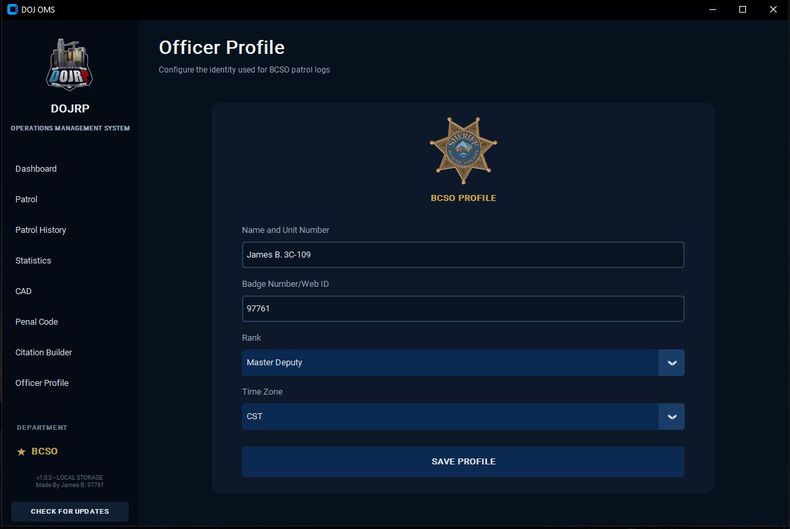

# DOJ OMS

### DOJRP Operations Management System

**A centralized Windows patrol workspace built for DOJRP law enforcement operations.**

DOJ OMS brings patrol tracking, subdivision assignments, patrol history, statistics, CAD access, Penal Code references, citation preparation, and officer information together in one standalone desktop application.

> **Current Release:** v1.0.0  
> **Platform:** Windows 10 / Windows 11  
> **Release Channel:** Stable

## Download DOJ OMS

The latest version of DOJ OMS is available through the **Releases** section of this repository.

### Installation

1. Open the latest DOJ OMS release.
2. Download `DOJ_OMS_Setup_v1.0.0.exe`.
3. Run the installer.
4. Complete the installation prompts.
5. Launch **DOJ OMS**.
6. Configure your information under **Officer Profile**.

Once installed, DOJ OMS includes an integrated update system and will notify you when a newer release becomes available.

---

# Operations Dashboard

The Dashboard provides a centralized starting point for patrol operations.

Officers can view their current duty status, begin or resume a patrol, access commonly used operational tools, review recent activity, and check for DOJ OMS updates.

---

# Patrol Management

DOJ OMS provides real-time patrol session tracking directly from the desktop application.

During an active patrol, officers can switch between supported assignments while DOJ OMS independently tracks the amount of time spent within each assignment.

### Supported BCSO assignments

- General Patrol
- Warrant Services Unit — WSU
- Wilderness Law Response — WLR
- Criminal Investigations Division — CID
- Traffic Enforcement Division — TED
- Canine / K9

The current assignment and total patrol duration remain visible throughout the patrol session.

---

# Patrol History

Completed patrol sessions are maintained within the officer's local patrol history.

Patrol History provides access to previous sessions for review and patrol-log management.

---

# Patrol Statistics

DOJ OMS automatically calculates patrol statistics from locally stored patrol history.

Officers can quickly review:

- Total patrol time
- Total completed patrols
- Current-month patrol time
- Current-month patrol count
- Time spent within individual assignments
- Patrol log submission status

---

# DOJRP CAD Access

The integrated CAD section provides quick access to the official DOJRP Computer Aided Dispatch system without requiring officers to separately locate the CAD portal.

---

# Penal Code Reference

DOJ OMS includes a local Penal Code reference system for officer-created authorized reference entries.

The application does **not** copy or redistribute the official DOJRP Penal Code database. Officers can create local reference entries for information they are authorized to maintain or open the official DOJRP Penal Code directly from the application.

---

# Citation Builder

The Citation Builder assists officers in preparing consistent citation information for transfer into the DOJRP CAD Citation Report.

The workspace provides fields for incident location information, offenses, and a standardized narrative structure.

Prepared information can then be copied individually using:

- Copy Postal
- Copy Location
- Copy Charges
- Copy Narrative

---

# Officer Profile

Officer Profile allows users to configure the identity used throughout supported DOJ OMS patrol functions.

Profile information includes:

- Name and unit number
- Badge Number / Web ID
- Rank
- Time zone

---

# Automatic Updates

DOJ OMS includes a built-in update system.

The application can check the official DOJ OMS distribution channel for newer releases and notify the user when an update becomes available.

Users can also manually select **CHECK FOR UPDATES** from within the application.

This allows future improvements, fixes, and new functionality to be distributed without requiring users to manually monitor for new versions.

---

# Local Data

DOJ OMS is designed around local application storage.

Officer profile information, patrol history, assignment timing, statistics, and other supported application information remain locally stored unless the user explicitly submits information through an integrated DOJRP service.

---

# System Requirements

**Operating System:** Windows 10 or Windows 11  
**Internet:** Required for online DOJRP services and update checking  
**Installation:** Standard Windows installation

---

# Getting Started

**1. Download**  
Download the latest DOJ OMS installer from Releases.

**2. Install**  
Run the installer and complete the Windows installation process.

**3. Configure**  
Open Officer Profile and enter your DOJRP information.

**4. Patrol**  
Return to the Dashboard and select **START BCSO PATROL**.

---

## Current Version

**DOJ OMS v1.0.0 — Stable**

Future releases can be installed through the integrated DOJ OMS update system.

---

### DOJRP Operations Management System

Built for streamlined DOJRP patrol operations.
