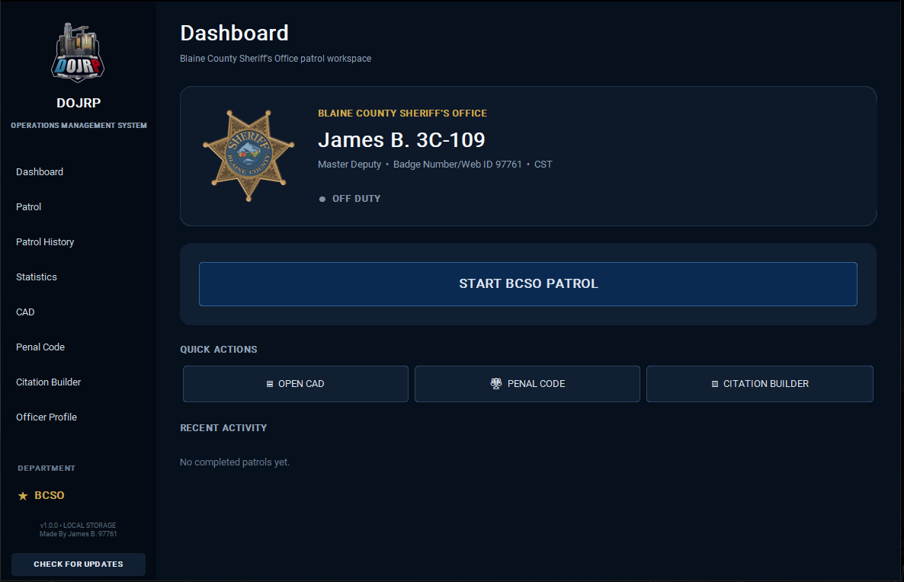
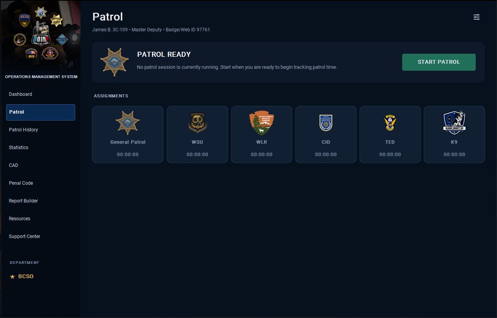
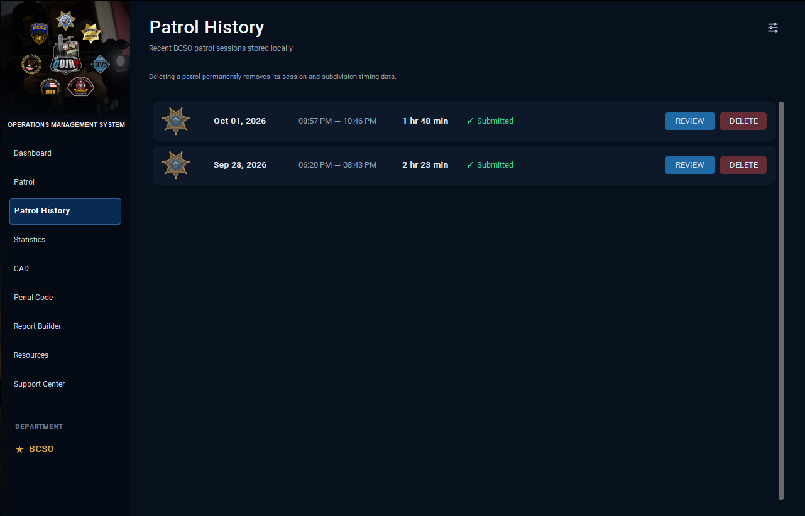
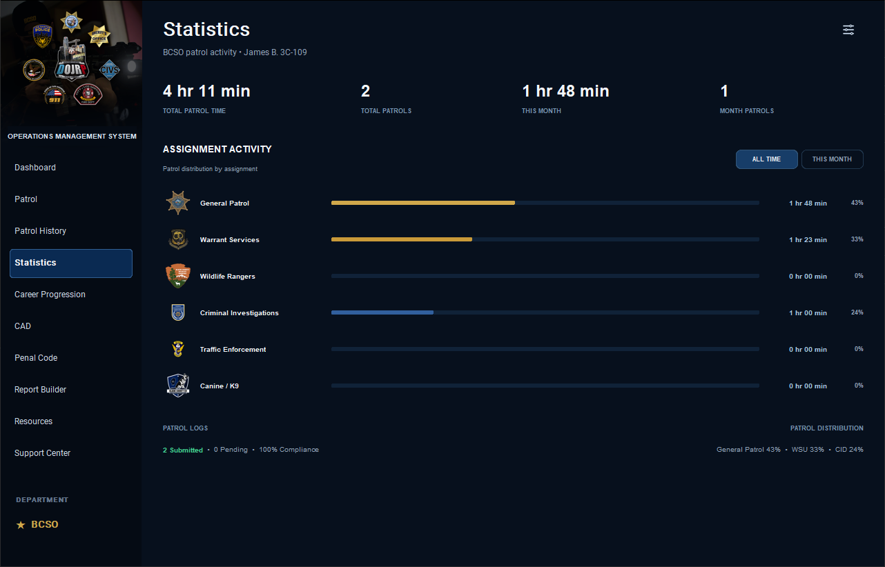
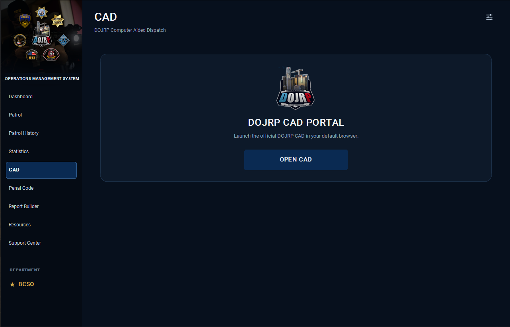
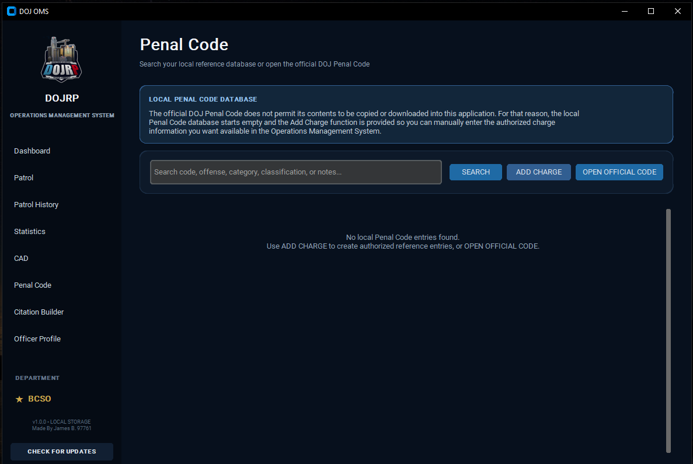
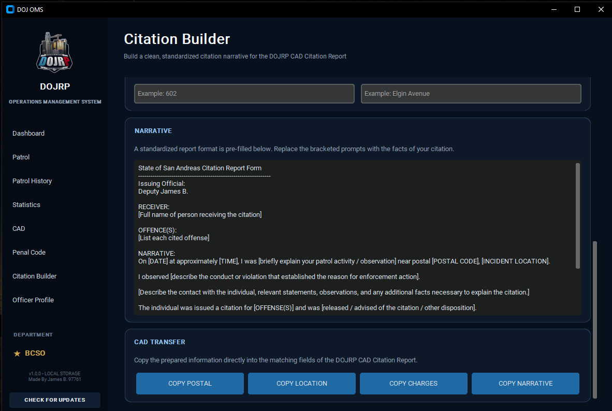
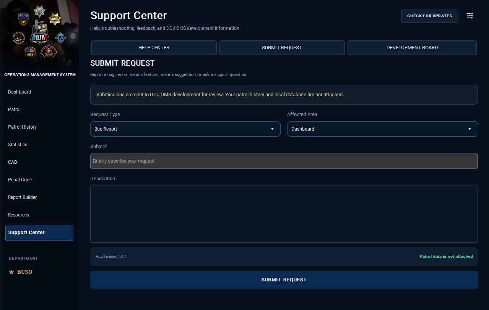

# DOJ OMS

### DOJRP Operations Management System

**A centralized Windows operations workspace built for DOJRP law enforcement members.**

DOJ OMS brings the tools commonly used during DOJRP law enforcement operations into one standalone desktop application.

Rather than keeping patrol tracking, department resources, CAD access, Penal Code references, report preparation, statistics, and officer information scattered across multiple locations, DOJ OMS provides a single workspace designed around the active officer and their department.

> **Current Release:** v1.4.1  
> **Platform:** Windows 10 / Windows 11  
> **Release Channel:** Stable  
> **Supported Departments:** BCSO & SAHP

---

# Download DOJ OMS

The latest stable version of DOJ OMS is available through the **Releases** section of this repository.

### Installation

1. Open the latest DOJ OMS release.
2. Download the latest `DOJ_OMS_Setup` installer.
3. Run the installer.
4. Complete the Windows installation prompts.
5. Launch **DOJ OMS**.
6. Complete the initial identity setup.
7. Create or select your Officer Profile.

Existing users can install newer versions directly over their current installation. Supported locally stored profile, patrol, statistics, and application data are preserved during normal upgrades.

DOJ OMS also includes an integrated update system for detecting future releases.

---

# What is DOJ OMS?

DOJ OMS is designed to function as an operational companion for DOJRP law enforcement members.

The application adapts around the user's **Officer Profile and department**, allowing one installation to support officers with different assignments, ranks, departments, and patrol histories.

Current functionality includes:

- Multi-department Officer Profiles
- Patrol session tracking
- Department and subdivision assignment tracking
- Patrol history
- Patrol statistics
- Department patrol-log integration
- Department-specific resource libraries
- Quick Resources
- DOJRP CAD access
- Local Penal Code references
- Report preparation
- DOJRP member verification
- Discord Rich Presence
- Integrated application updates
- Support and application information

The goal is simple: **reduce the number of separate resources an officer needs to manage while providing a cleaner workspace for day-to-day DOJRP operations.**

---

# Supported Departments

## Blaine County Sheriff's Office

DOJ OMS provides full operational support for the **Blaine County Sheriff's Office (BCSO)**.

Supported BCSO assignments include:

- General Patrol
- Warrant Services Unit — WSU
- Wildlife Rangers — WLR
- Criminal Investigations Division — CID
- Traffic Enforcement Division — TED
- Canine / K9

BCSO Officer Profiles automatically receive the appropriate department resources, patrol options, Quick Resources, and department-specific Report Builder presentation.

---

## San Andreas Highway Patrol

DOJ OMS v1.4.0 introduced full support for the **San Andreas Highway Patrol (SAHP)**.

Supported SAHP assignments include:

- BACO
- BSO - ISU
- BSO - K9
- BTE - DUI-E
- BTE - MBU
- BTE - CVE
- BTE - MRU

SAHP integration includes department-specific ranks, auxiliary ranks, patrol functionality, resources, Quick Resources, and Report Builder presentation.

Additional department integrations can be incorporated as DOJ OMS continues to expand.

---

# Operations Dashboard

The Dashboard serves as the primary operational landing point after selecting an Officer Profile.

From the Dashboard, officers can quickly review their current profile and patrol status while accessing commonly used operational tools and department-specific resources.

Quick Resources automatically adapt to the active Officer Profile's department.

---

# Officer Profiles

DOJ OMS supports **multiple Officer Profiles** within the same installation.

Each profile can maintain its own:

- Department
- Name and unit number
- Badge Number / Web ID
- Rank
- Time zone
- Patrol history
- Patrol statistics

Switching profiles allows DOJ OMS to automatically adapt supported areas of the application to that officer.

Department-specific resources, patrol assignments, Report Builder information, and other supported functionality change according to the active profile.

---

# Member Verification

DOJ OMS includes a member verification system for DOJ members-only application material.

Users provide their DOJRP identity information during initial setup, including their name and website profile.

Verification information is used to determine access to protected DOJ member resources.

Access can reflect verification states such as:

- Pending
- Approved
- Denied
- Revoked

Verification is designed around DOJRP membership access.

---

# Patrol Management

DOJ OMS provides real-time patrol session tracking directly from the desktop application.

Officers can:

- Start a patrol
- Pause a patrol
- Resume a patrol
- Change assignments during a patrol
- End a patrol

DOJ OMS independently tracks time spent within supported assignments while maintaining the total duration of the patrol.

Available assignments automatically change according to the active Officer Profile's department.

---

# Patrol Log Integration

DOJ OMS helps streamline department patrol-log submissions.

Supported department integrations can automatically prepare applicable patrol information based on the completed session.

Officers should review generated patrol-log information for accuracy and add any required information that cannot be determined automatically, such as training or other special patrol activity.

Patrol-log functionality is designed to reduce repetitive entry while keeping the officer responsible for reviewing the final submission.

---

# Patrol History

Completed patrol sessions are maintained within the active Officer Profile's local patrol history.

Patrol History provides a centralized location for reviewing previous sessions and associated patrol information.

Because patrol history is associated with individual Officer Profiles, users with multiple profiles can maintain separate operational histories within the same DOJ OMS installation.

---

# Patrol Statistics

DOJ OMS automatically calculates statistics using locally stored patrol history.

Statistics include information such as:

- Total patrol time
- Total completed patrols
- Current-month patrol time
- Current-month patrol count
- Assignment and subdivision time
- Patrol-log submission information

Statistics remain associated with the Officer Profile responsible for the patrol activity.

---

# Department Resources

The Resources module provides organized access to operational material for the active Officer Profile's department.

Instead of maintaining a large collection of bookmarks or repeatedly searching department resources, supported documents and forms can be accessed directly through DOJ OMS.

Resources are organized into department and subdivision-specific sections.

### BCSO

Resources are available for the department and supported areas including:

- WSU
- WLR
- CID
- TED
- K9

### SAHP

Resources are organized across:

- Department Links & Forms
- BACO
- BSO
- BTE

These areas contain applicable documents, forms, training material, operational references, certification information, and subdivision resources.

External resources open through the user's default browser.

---

# Quick Resources

Frequently used department material is available directly from the Dashboard through **Quick Resources**.

Quick Resources automatically change according to the active Officer Profile.

For example, SAHP Quick Resources provide direct access to commonly used material including:

- Standard Operating Procedures
- Policy Memos
- Patrol Zone Map
- Vehicle and Uniform Structure

This allows commonly referenced material to be reached without navigating through the complete Resources library.

---

# DOJRP CAD Access

DOJ OMS provides quick access to the official DOJRP Computer Aided Dispatch system from within the operational workspace.

This reduces the need to separately locate commonly used DOJRP services while working through the application.

---

# Penal Code Reference

DOJ OMS includes a local Penal Code reference system.

The application does **not** copy or redistribute the official DOJRP Penal Code database.

Instead, officers can maintain local reference entries for information they are authorized to retain or open the official DOJRP Penal Code resource through DOJ OMS.

Local Penal Code information can also be used by supported features such as the Report Builder.

---

# Report Builder

The **Report Builder** provides a modern workspace for preparing standardized information before transferring it into DOJRP reporting systems.

Currently supported report types include:

- Citation Report
- Arrest Report
- Incident Report

Selecting a report type automatically adjusts the applicable report-form heading while maintaining a consistent workspace.

The Report Builder provides:

- Department-specific presentation
- Active Officer Profile information
- Rank-based Issuing Official information
- Badge Number / Web ID integration
- Incident postal and location information
- Local Penal Code charge searching
- Manual charge entry
- Multiple removable charges
- Standardized narrative preparation
- Individual CAD transfer controls

When entering charges, DOJ OMS can automatically display matches from the officer's **local Penal Code references**.

Charges not contained within the local database can still be entered manually.

Prepared information can then be copied for transfer into the appropriate DOJRP system.

The Report Builder automatically adapts officer information and department presentation according to the active Officer Profile.

---

# Discord Rich Presence

DOJ OMS includes optional **Discord Rich Presence** integration.

When enabled, Discord can display information associated with DOJ OMS activity, including the active Officer Profile and patrol state.

During active patrols, Rich Presence can reflect information such as:

- Active assignment
- On-duty status
- Patrol activity timing

Pause, Resume, and End Patrol states automatically update supported Discord presence information.

Privacy controls for Discord Rich Presence are available through Settings.

Discord availability is **not required** for normal DOJ OMS operation.

---

# Settings

Application configuration is centralized within the DOJ OMS Settings interface.

Settings provide access to supported options including:

- Officer Profile management
- Profile switching
- General application preferences
- Startup behavior
- Appearance and interface scaling
- Discord Rich Presence preferences
- Update management
- Application information

This separates operational functions from application configuration while keeping commonly changed preferences in one location.

---

# Support Center

DOJ OMS includes an integrated Support Center for application assistance and information.

The Support Center provides access to supported help material, frequently asked questions, update checking, and other application support functionality.

Support functionality will continue to expand alongside DOJ OMS.

---

# Automatic Updates

DOJ OMS includes a built-in update system.

The application can check the official DOJ OMS distribution channel for newer releases and notify users when an update becomes available.

Users can also manually use **Check for Updates** from within DOJ OMS.

Existing installations can then be upgraded without requiring users to continually monitor the repository for new versions.

---

# Local Data

DOJ OMS is designed primarily around local application storage.

Supported information such as:

- Officer Profiles
- Patrol history
- Assignment timing
- Patrol statistics
- Application preferences

is maintained locally unless the user explicitly uses functionality that submits information through an integrated external service.

---

# System Requirements

**Operating System:** Windows 10 or Windows 11  
**Internet:** Required for online DOJRP resources, verification, external services, and update checking  
**Installation:** Standard Windows installation  
**Discord:** Optional

---

# Getting Started

### 1. Download

Download the latest stable DOJ OMS installer from **Releases**.

### 2. Install

Run the installer and complete the Windows installation process.

### 3. Verify

Complete the initial DOJRP identity information required by the application.

### 4. Create an Officer Profile

Configure your department, name/unit number, Badge Number / Web ID, rank, and other supported profile information.

### 5. Start Operating

Use the Dashboard to access patrol functionality, department resources, reporting tools, CAD, Penal Code references, and other supported DOJ OMS features.

---

# Current Version

**DOJ OMS v1.4.1 — Stable**

v1.4.1 currently provides operational support for:

**Blaine County Sheriff's Office**  
**San Andreas Highway Patrol**

DOJ OMS remains under active development, with additional functionality and department support planned for future releases.

---

# Development

DOJ OMS began as a patrol-management utility and has expanded into a broader operations workspace for DOJRP law enforcement members.

Development is focused on improving everyday usability, consolidating commonly used operational resources, expanding department-specific functionality, and reducing repetitive work where practical.

Future releases will continue expanding the platform while maintaining compatibility with existing Officer Profiles and locally stored operational information.

Feedback, bug reports, and feature suggestions are encouraged.

---

# Support

For assistance with DOJ OMS, bug reports, or other support requests, use the application's **Support Center**.

---

### DOJRP Operations Management System

**One workspace. Your department. Your patrol.**
